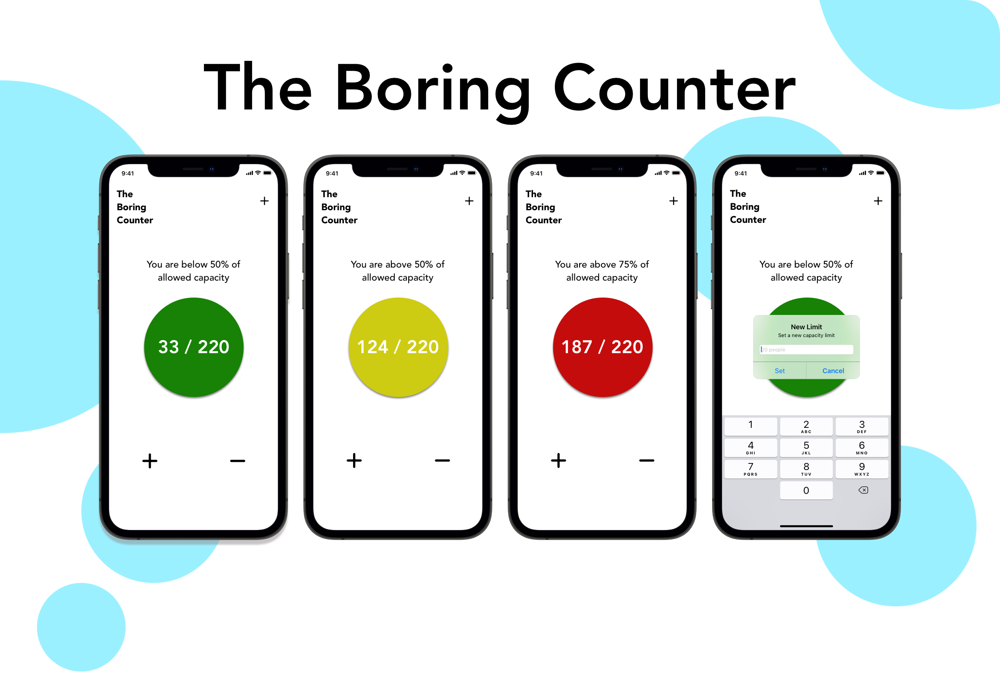

# The Boring Counter

A simple iOS counter app to keep track of people inside a closed space.

## Description

It's a pretty simple app consisting of two buttons to keep track of how many people enter or exit a closed space. This can be used for many situations.

- Friendly UI that indicates the current state of the allowed capacity.
- Pretty easy to use and set new capacity limits.

## Screenshots

Here is how it looks on the iPhone 12 Pro Max Simulator. 

