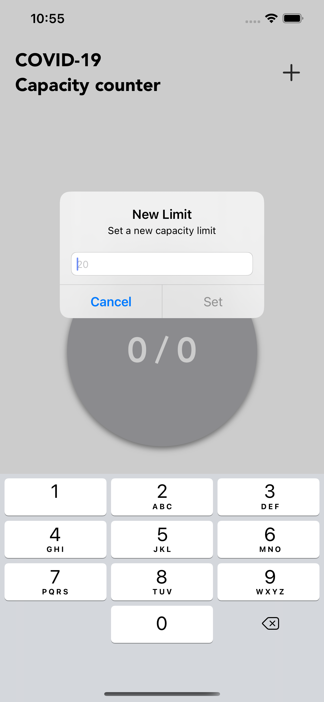
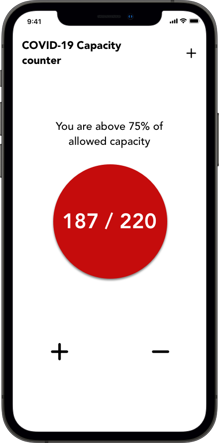
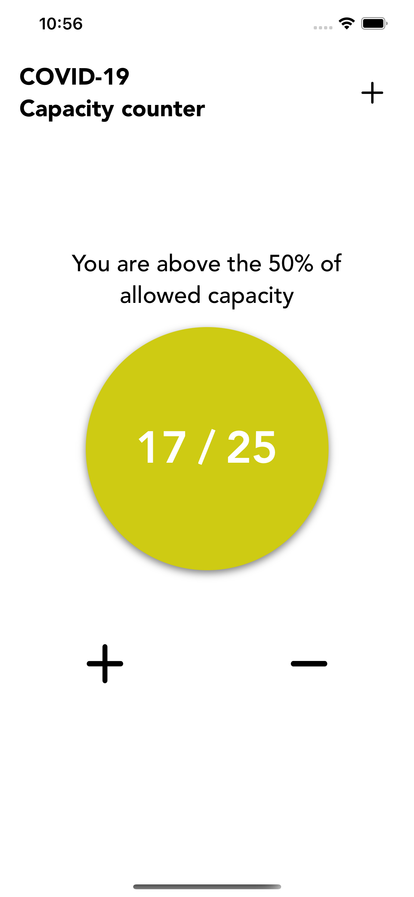

## Why I created this app?
Honestly, this was kind of an experiment to see understand how was the process of submitting an iOS app to the App Store. I wanted to start with a simple app (currently working on a more complicated app of my own) and see what problems I may encounter during the submit process. 

## Description

COVIDCount is a counter where you keep track of how many people enter or exit a closed space setting a limit capacity, following the COVID-19 health and safety protocols for closed areas. It's a bit late to create this kind of app but who knows, maybe somebody needs it at the moment! Also, the source code is here so you can check it out how I did this.

### Features

- Friendly UI that indicates the current state of the allowed capacity with bright colors and a message.
- Straight to the point, no complicated paths to use it.

### Screenshots
Here is how it looks on the iPhone 12 Pro Max

### Contact
If you have any thoughts or suggestions you can reach me out here:
- Mail: alex.hernandezc.21@gmail.com

